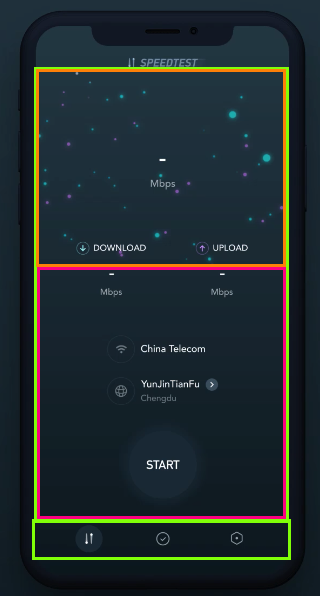

# Journal

## Oct 15th
- Recieved link to [Speed Test Animation](https://www.uplabs.com/posts/speedtest-animation)
- Watch video numerous times
- Started thinking about major parts and what I liked to work on first.

## Oct 16th

### Initial Screen Breakdown

This screen is inside of a tab bar view controller. You can see there are three tabs. The demo is on the first tab which I'm going to call the SpeedTestView. The second and third tab are not demoed. The screen shown is composed of two screens. The animated image view on the top, the MeteorView and the labels and start buttons on the bottom.

### User Experience

This is super straight forward, the start button is clicked and the download test is ran, then the upload test is ran. When the tests are finished the screen automatically transition to a test summary view (SpeedTestSummaryView).

### Speed Test Animation Breakdown

When the speed test starts a down arrow is shown in the middle of the animation with the blue meteors going toward it. An overlay from the top showing the ping, jitter, and loss. Also another overlay is shown from the bottom showing the speed.
 
After the download test is completed an upload test is started. The middle arrow flips and meteors become purple and start going outwards. The overlay values are still updated.  
  
Then the view is transitioned to the summary view.

### Speed Test Summary Breakdown
