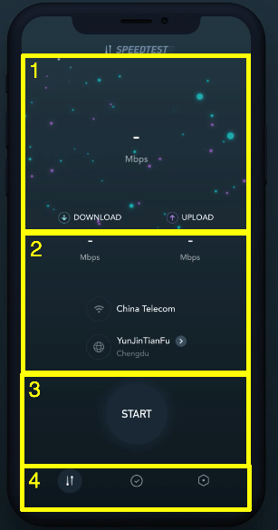
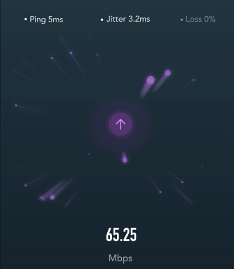
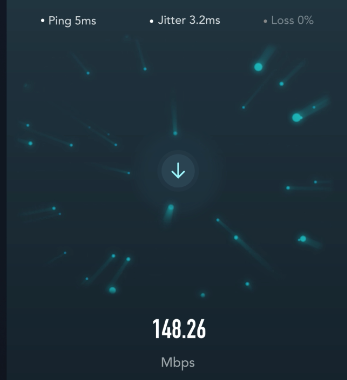
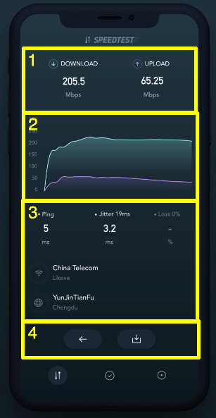

# Journal

## Oct 15th
- Recieved link to [Speed Test Animation](https://www.uplabs.com/posts/speedtest-animation)
- Watch video numerous times
- Started thinking about major parts and what I liked to work on first.

## Oct 16th

### Initial Screen Breakdown

This screen is inside of a tab bar view controller. You can see there are three tabs in section 4. The demo is on the first tab which I'm going to call the SpeedTestViewController. The second and third tab are not demoed. The screen shown is composed of two screens. In section 1 the animated image view on the top (the MeteorView). In section 2 and 3 there is the labels and start button.

### User Experience

This is super straight forward, the start button is clicked and the download test is ran, then the upload test is ran. When the tests are finished the screen automatically transition to a test summary view (SpeedTestSummaryView).

### Speed Test Animation Breakdown

When the speed test starts there is a quick animation on the button. Then on the top part of the MeteorView and overlay is shown with the ping, jitter, and loss. Also another overlay is shown from the bottom showing the speed. Also the down arrow is shown in the middle of the animation with the blue meteors moving toward it.
 
After the download test is complete an upload test is started. The middle arrow flips and meteors become purple and start moving away. The overlay values are still updated.  
  
When the test is done the view transitions to the summary view.

### Speed Test Summary Breakdown
This screen shows the result of running the speed. In section 1 it shows the average download and upload speeds. In section 2 an animated graph of the speeds achieved through out the test. In section 3 the average ping, jitter, and % loss, the wireless carrier, and I think it's the name of the wifi endpoint. Finally in section 4 there are two buttons one to go back to the speed test and one to share the results of the test.

  

# Oct 17

Let's write some code!!! Enough of breaking it down. I want to get my feet wet. First thing I did was create a new project. Then in story board I added a tab bar view controller. Also in the info.plist I set the appearance to dark, so the app only supports dark mode and only portrait for iPhone. I also create a new [notes](notes.md) file to keep track of improvements, concerns, and questions. Then added the start button which I had some struggles matching the colors for it and it's glow. The server, wifi, and title were easily added. I think they look good. Next up is the SpeedTestView which after some playing around with an [old project](https://github.com/mike011/AnimationPreview) of mine in which I did a bunch of animations I'm confident I can replicate the upload animation using a CAEmitterLayer. I'm not sure how to do the download animation as the particles are not emitted from a source and converge on a point.

# Oct 18

Well I went for a nice long walk and came up with some ideas on how to reverse the upload animation. One idea was to create an opaque overlay to hide the birth of the emissions from the center area, but how would I show the live ones, so this wasn't going to work. Another was to use a SceneKit animation, but I didn't want to create a canned animation, I might do this for the start button, but it didn't feel right for the download animation. I also tried changing the emission type to circular and setting a radius, but the emissions are still birthed inside that radius. Eventually the breakthrough came when I landed on a line animation. Line animation you can direct towards a point, so I was thinking I'd have to 8 animation (Top Left, Top Right, Left High, Left Low, Right High, Right Low, Bottom Left, and Bottom Right). These would animation from start area at the edge of screen and work there way towards the middle. This ended up being overkill and I just needed 4 animations (Top Left, Top Right, Bottom Left, Bottom Right). So I copied an pasted the original download into 4 different calls. It's ugly code and needs to be cleaned up, but I find it is definitely looking like the spec. So I've for now isolated it into it's own class called DownloadAnimation where I can do some clean up later. I also got the timers going for showing the upload animation for 5 seconds, then the download animation for 5 seconds.

ext up, I'm going to add the overlays (center image, jitter, ping, speed, etc).

# Oct 19

I skipped showing the overlays in favour of populating the second screen. I go the back and share buttons, the server and wifi and the upload and download views all correctly placed. I honestly have no idea how to do the graph. But I want to get everything layout first, then worry about how that's going to get drawn. So today I'm going to continue populating the summary view.

I noticed last night what when the animation starts the wifi and server views are transitioned further down the screen and the download speed test view increases in size when the test starts. I'm not sure how much effort I'm going to put into duplicating this behaviour. I'm not a big fan of it. Well it turned out to be a lot of fun (not sarcastic) getting the start button animation shown and having it slowly disappear.

I'm really enjoying this project and trying to duplicate the behaviour of the spec. The further I get into the more nuances I'm seeing and the more there could be to polish.

Next up, I'm going to get the server and wifi views to transition down. This will be interesting because I've done transitions on vertical constraints in the past, but not on vertical and horizontal at the same time.

Well, that went pretty went pretty smooth. I really like how the server and wifi come down. Next up is the make the upload, download, and current speed come down. Awesome, nice and simple just had to animate the one constraint. Tomorrow, I want to clean up the download and upload animations, get the jitter, etc showing, and populate them with some values.

# Oct 20

Uggh, first bug today. The console was spitting out a couple of "Unable to simultaneously satisfy constraints.". So I stashed my changes and re-ran, still saw the problem. So I created a new temp git branch and reset my last commit, tried again, failed again. And one more time and no error messages. I've now nailed it down to the vertical and horizontal constraints on the server image. Pheww, this turned out to be a couple of easy fixes. I just had to remove the constraints on the local view as it's now constrained on the whole view (to allow it to move)

Got the jitter, etc showing, I ended up putting everything in one view and animating that to be shown instead of what I originally did was animation each unit by itself. One thing I know that will change is when real values are added in the sizing of a lot of the views will have to change.

So added some fake random values for the upload and download test and noticed that it does NOT transition to a new screen, but hides the jitter etc, and brings up the upload and download to the top of the screen and shows the summary view and brings back up the server and wifi views. I really want to make this change as it looks really good, but I find this view getting quite complicated.

The result view chart I'm easily the most lost on. I've quickly looked at https://github.com/danielgindi/Charts and it might cover what I need. I'm trying to not rely on external libraries, but this view would be a bunch of work if I did it from scratch.
